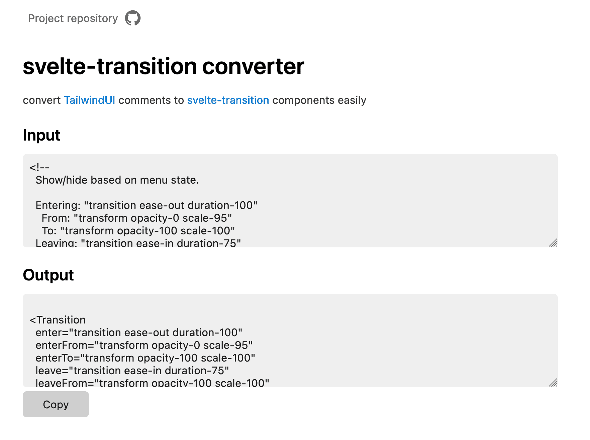

# svelte-transition-converter
convert [TailwindUI](https://tailwindui.com) comments to [svelte-transition](https://www.npmjs.com/package/svelte-transition) components easily

You can use `svelte-transition-converter` [here](https://quick-898.github.io/svelte-transition-converter/).